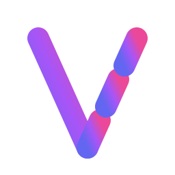
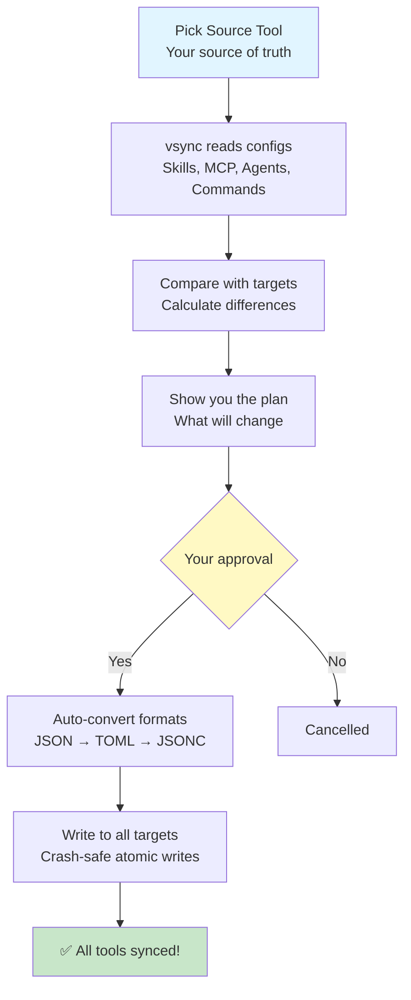

<div align="center">



# vsync

### **One config. Many AI tools. Zero pain.**

[](https://github.com/nicepkg/vsync)
[](https://opensource.org/licenses/MIT)
[](https://github.com/nicepkg/vsync/pulls)
[](https://github.com/nicepkg/vsync)

[简体中文](./README_cn.md) | English


---

**One-command config sync for AI vibe coding tools**

Managing Skills, MCP servers, Agents & Commands across multiple AI coding tools is a nightmare.
Each tool has its own directories and formats. vsync solves this with one simple command.

[Get Started](#-quick-start) · [Features](#-features) · [Documentation](https://vsync.xiaominglab.com)

</div>

---

## ✨ Why vsync?

**The Problem**: You love using multiple AI vibe coding tools (Claude Code, Cursor, OpenCode, Codex...), but each tool has:

- Different directory structures for Skills, Agents, Commands, MCP servers
- Different config file formats (JSON, TOML, JSONC)
- Different environment variable syntax

Managing configurations across tools becomes a nightmare, especially for teams.

**The Solution**: vsync gives you one command to sync everything. Pick one tool as your source of truth, and all others stay perfectly in sync.

### The Problem We Solve

| 😫 Without vsync                                                     | 🎉 With vsync                                                |
| :------------------------------------------------------------------- | :----------------------------------------------------------- |
| 📋 Manually copy configs between multiple vibe coding tools          | ⚡ One command syncs everything automatically                |
| 📂 Different directories for Skills/Agents/Commands/MCP in each tool | 🎯 One command maps to all correct paths                     |
| 🔥 Environment variables break during migration                      | 🛡️ Variables preserved safely (JSON ↔ TOML ↔ JSONC)          |
| 🤷 No idea which configs are outdated or in conflict                 | 📊 Smart diff shows exactly what changed and why             |
| ⚠️ Risky deletions, manual cleanup nightmares                        | ✅ Safe mode by default, Prune mode for strict mirroring     |
| 🔧 Multiple tools = multiple config formats                          | 🎯 Transparent format conversion (preserves JSONC comments!) |
| 🐌 Copying dozens of configs manually is painfully slow              | ⚡ Instant sync with parallel operations & smart caching     |

### Key Benefits

```
📚  Single Source of Truth → All tools sync from one place
🎯  Smart Diff Planning    → Preview changes before applying
⚡  Safe & Prune Modes     → Choose your sync strategy
🌈  Multi-Tool Support     → Claude Code, Cursor, OpenCode, Codex
🗣️  Multi-Language CLI     → English & 中文 (Chinese)
⚡  Performance Optimized  → Parallel ops, caching, symlinks
🔗  Symlink Support        → Share Skills via symlinks (optional)
```

### How It Works



**The magic**: Edit configs in ONE tool → Run `vsync sync` → ALL tools stay in sync

---

## 🎯 Features

| Feature               | Description                           | Status  |
| :-------------------- | :------------------------------------ | :------ |
| **Skills Sync**       | Sync Agent Skills across all tools    | ✅ v1.0 |
| **MCP Sync**          | Sync MCP servers with security checks | ✅ v1.0 |
| **Diff Planning**     | Preview changes before applying       | ✅ v1.0 |
| **Safe Mode**         | Add & update only, no deletions       | ✅ v1.0 |
| **Prune Mode**        | Strict mirroring with deletions       | ✅ v1.0 |
| **Atomic Writes**     | All-or-nothing file operations        | ✅ v1.0 |
| **Manifest Tracking** | Hash-based change detection           | ✅ v1.0 |
| **User Layer**        | Global configs (~/.vsync.json)        | ✅ v1.1 |
| **Agents Sync**       | Custom AI agents                      | ✅ v1.1 |
| **Commands Sync**     | Quick commands                        | ✅ v1.1 |
| **Codex Support**     | Full Codex integration (TOML format)  | ✅ v1.1 |
| **Multi-Language**    | English & 中文 CLI output             | ✅ v1.2 |
| **Performance**       | Parallel operations, smart caching    | ✅ v1.2 |
| **Symlinks**          | Symbolic link support                 | ✅ v1.2 |
| **Import/Export**     | Share configs between projects        | ✅ v1.1 |

---

## ⚡ Quick Start

Full documentation: https://vsync.xiaominglab.com

### Installation

```bash
# Option 1: Run directly with npx (no installation needed)
npx @nicepkg/vsync

# Option 2: Install globally with npm
npm install -g @nicepkg/vsync

# Verify installation
vsync --version
```

### Initialize

```bash
# Project-level configuration
vsync init

# User-level (global) configuration
vsync init --user
```

**Interactive prompts:**

```
🚀 Welcome to vsync!

✔ Detecting existing tools...
✔ Detected: claude-code, cursor

? Which AI coding tools do you use?
  ◉ claude-code (detected)
  ◉ cursor (detected)
  ◯ opencode
  ◯ codex

? Which tool is your source of truth?
  ❯ claude-code

? What do you want to sync?
  ◉ Skills
  ◉ MCP

✔ Configuration created
✔ Cache directory created
✔ Manifest initialized

✅ Setup complete! Run vsync sync to start syncing
```

### Sync Your Configs

```bash
# Safe mode (default: no deletions)
vsync sync

# Preview changes without applying
vsync sync --dry-run

# Strict mirroring (deletes extra items in targets)
vsync sync --prune
```

**Example output:**

```
📖 Reading source (claude-code)...
  ✓ Found 3 skills
  ✓ Found 2 MCP servers

📊 Analyzing differences...

📋 Sync Plan (Safe Mode)

cursor:
  CREATE:
    • skill/deploy-prod
  UPDATE:
    • skill/git-release
    • mcp/github

? Proceed with sync? (Y/n) y

✓ Sync completed in 1.2s
```

### Real-World Usage

**Scenario 1: Team Onboarding**

```bash
# New team member joins, already has Claude Code setup
cd my-project
vsync init  # Choose Claude Code as source, Cursor & OpenCode as targets
vsync sync  # Boom! All tools configured in seconds

# Their entire AI coding environment is now in sync with the team
```

**Scenario 2: User-Level Config Sync Across Multiple Tools**

```bash
# Set up your global personal configs once
vsync init --user  # Configure which tools to sync
vsync sync --user  # Sync your personal Skills, MCP servers, Agents globally

# Now ALL your tools share the same user-level configs
# Works across all your projects automatically
```

**Scenario 3: Migration from One Tool to Another**

```bash
# Moving from Cursor to Claude Code?
vsync init  # Choose Cursor as SOURCE (the reference/standard)
                # Choose Claude Code as TARGET (will pull from source)
vsync sync  # All your skills, MCP servers, agents migrated instantly

# SOURCE = Your standard reference (everything syncs FROM here)
# TARGET = Will match the source (everything syncs TO here)
```

---

## 🛠 CLI Commands

### Core Commands

```bash
# Initialize configuration
vsync init [--user]

# Sync configurations
vsync sync [--user] [--dry-run] [--prune]

# View sync plan without executing
vsync plan [--user]

# Check sync status
vsync status [--user]

# List configurations
vsync list [skills|mcp] [--user]

# Clean configs from targets
vsync clean [name] [--user] [--from-source]

# Import from another project
vsync import <path> [--user]
```

### Example Workflows

**1. Daily sync after updating Skills:**

```bash
# Edit your Skills in Claude Code
vim ~/.claude/skills/my-skill/SKILL.md

# Sync to all target tools
vsync sync
```

**2. Preview changes before applying:**

```bash
vsync plan
# Review the plan
vsync sync
```

**3. Strict mirror mode (delete outdated configs):**

```bash
vsync sync --prune
```

**4. Clean up a skill from all targets:**

```bash
# From targets only (source unchanged)
vsync clean skill/old-skill

# From source AND all targets (dangerous!)
vsync clean skill/old-skill --from-source
```

**5. Import configs from another project:**

```bash
vsync import ../other-project
```

---

## 📋 Configuration

### .vsync.json

**Project-level:** `<project>/.vsync.json`
**User-level:** `~/.vsync.json`

```json
{
  "version": "1.0.0",
  "level": "project",
  "source_tool": "claude-code",
  "target_tools": ["cursor", "opencode", "codex"],
  "sync_config": {
    "skills": true,
    "mcp": true
  },
  "use_symlinks_for_skills": false,
  "language": "en"
}
```

**Key Settings**:

- `source_tool`: Your source of truth (where you edit configs)
- `target_tools`: Tools that will sync FROM the source
- `sync_config`: What to sync (skills, mcp, agents, commands)
- `use_symlinks_for_skills`: Use symlinks instead of copying (saves disk space)
- `language`: CLI language - `"en"` or `"zh"` (user-level only)

### Config Format Differences (Why You Need vsync)

Each vibe coding tool uses different formats AND different directory structures. vsync handles all the complexity:

**Directory Structure Differences**:
| Config Type | Claude Code | Cursor | OpenCode | Codex |
|:------------|:------------|:-------|:---------|:------|
| **Skills** | `.claude/skills/` | `.cursor/skills/` | `.opencode/skills/` | `.codex/skills/` |
| **Agents** | `.claude/agents/` | N/A | `.opencode/agents/` | N/A |
| **Commands** | `.claude/commands/` | `.cursor/commands/` | `.opencode/commands/` | N/A |
| **MCP Config** | `.mcp.json` | `mcp.json` | `opencode.json(c)` | `config.toml` |

**File Format Differences**:
| Aspect | Claude Code | Cursor | OpenCode | Codex |
|:-------|:------------|:-------|:---------|:------|
| **Format** | JSON | JSON | JSONC (with comments) | TOML |
| **MCP Field Name** | `mcpServers` | `mcpServers` | `mcp` ⚠️ | `mcp_servers` |
| **Env Var Syntax** | `${VAR}` | `${env:VAR}` | `{env:VAR}` | No interpolation |
| **Type Field** | Not required | Not required | **Required** (`local`/`remote`) | Required |

**Without vsync**:

- ❌ Manually copy files between different directories
- ❌ Remember which tool uses which path
- ❌ Convert environment variable syntax by hand
- ❌ Often break configs or forget required fields

**With vsync**:

- ✅ One command → auto-syncs to all tools
- ✅ Automatic format conversion
- ✅ Skills support symlinks (optional)

### Advanced Features (v1.2+)

**Performance Optimizations**:

- ⚡ **Parallel Operations**: Sync to multiple targets simultaneously
- 💾 **Smart Caching**: Skip unchanged configs using hash-based manifest
- 🔗 **Symlink Support**: Follows symbolic links correctly
- 📦 **Optimized I/O**: Atomic writes with fsync for crash safety

**Format Intelligence**:

- 🎯 **TOML Support**: Full Codex config.toml handling
- 💬 **JSONC Preservation**: Keeps comments in OpenCode configs
- 🔄 **Cross-Format Variables**: Converts `${VAR}` ↔ `${env:VAR}` ↔ `{env:VAR}` automatically
- 🛡️ **Variable Safety**: Never expands environment variables, preserves syntax

## 🎨 Sync Modes

### Safe Mode (Default)

**What it does:**

- ✅ Create new items
- ✅ Update existing items
- ❌ **Never deletes**

```bash
vsync sync
```

### Prune Mode

**What it does:**

- ✅ Create new items
- ✅ Update existing items
- ⚠️ **Deletes items not in source**

```bash
vsync sync --prune
```

**Use when:** You want strict mirroring (e.g., cleaning up old configs)

## ❓ FAQ

**Q: Which tool should I use as the source?**
A: We recommend **Claude Code** as it has the most complete feature set. However, you can use any tool as your source.

**Q: Will vsync overwrite my existing configs?**
A: By default, **Safe Mode** only creates and updates—it never deletes. Use `--prune` if you want strict mirroring.

**Q: What happens if I edit configs directly in target tools?**
A: Changes in target tools will be overwritten on the next sync. The SOURCE is your reference standard—everything syncs FROM the source. Always edit in your source tool, or use `import` to pull changes from another project.

**Q: How do I switch my source tool?**
A: Run `vsync init` again and choose a different source. Then sync to update all targets.

**Q: Does it work with monorepos?**
A: Yes! Each project can have its own `.vsync.json`. User-level configs (`~/.vsync.json`) work globally.

**Q: Is it safe to commit `.vsync.json` to git?**
A: Yes! The config file contains no secrets—only tool names and sync preferences. MCP configs with secrets should use environment variables.

**Q: Can I sync in both directions?**
A: vsync is one-directional (source → targets). To switch directions, re-run `init` and choose a different source tool.

**Q: What's the difference between project-level and user-level?**
A:

- **Project-level** (`.vsync.json`): Team configs, checked into git
- **User-level** (`~/.vsync.json`): Personal global configs, not shared

---

## 🤝 Contributing

Contributions are welcome! Here's how you can help:

- ⭐ **Star this repo** - Help others discover this project
- 🐛 **Report bugs** - Open an issue if something isn't working
- 💡 **Suggest features** - What would make this better for you?
- 🔧 **Submit PRs** - Improve code, docs, or add features

See [CONTRIBUTING.md](./CONTRIBUTING.md) for guidelines.

### Development

Want to contribute? See [CONTRIBUTING.md](./CONTRIBUTING.md) for development setup and guidelines.

### Contributors

<a href="https://github.com/nicepkg/vsync/graphs/contributors">
  
</a>

---

## 📚 Roadmap

### v1.0 (MVP) ✅ Released

- [x] Skills sync (with full file support)
- [x] MCP sync with security checks
- [x] Safe & Prune modes
- [x] Intelligent diff planning
- [x] Claude Code, Cursor, OpenCode support
- [x] Atomic writes & crash safety
- [x] Hash-based manifest system

### v1.1 ✅ Released

- [x] User-level configs (~/.vsync.json)
- [x] Agents sync (custom AI agents)
- [x] Commands sync (quick commands)
- [x] Full Codex support (TOML format)
- [x] Import command (share configs between projects)
- [x] Clean command enhancements

### v1.2 ✅ Current

- [x] Multi-language support (English & 中文)
- [x] Performance optimizations (parallel ops, caching)
- [x] Symbolic link support
- [x] 612 tests passing (45 test files)
- [x] Production-ready stability

### v1.3 🔜 Next (Watch Mode & Automation)

- [ ] Watch mode (auto-sync on file changes)
- [ ] GitHub Actions integration
- [ ] Pre-commit hooks
- [ ] Validation improvements

### v2.0 🚀 Future

- [ ] Web UI dashboard
- [ ] Configuration templates
- [ ] VS Code extension
- [ ] Plugin system

---

## 📄 License

MIT © [nicepkg](https://github.com/nicepkg)

---

<div align="center">

**If this project helped you, please consider giving it a ⭐**

<a href="https://github.com/nicepkg/vsync">
  
</a>

Made with ❤️ by [nicepkg](https://github.com/nicepkg)

</div>
