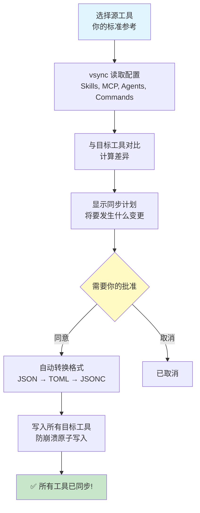

<div align="center">


# vsync

### **一处配置,多个 AI 工具同步,不再折腾**

[](https://github.com/nicepkg/vsync)
[](https://opensource.org/licenses/MIT)
[](https://github.com/nicepkg/vsync/pulls)
[](https://github.com/nicepkg/vsync)

简体中文 | [English](./README.md)


---

**AI 氛围编程工具配置一键同步**

在多个 AI 编程工具间管理 Skills、MCP servers、Agents 和 Commands 是噩梦。
每个工具都有自己的目录和格式。vsync 用一条命令解决这个问题。

[立即开始](#-快速开始) · [功能特性](#-功能特性) · [文档](https://vsync.xiaominglab.com)

</div>

---

## ✨ 为什么选择 vsync?

**问题所在**: 你喜欢使用多个 AI 氛围编程工具 (Claude Code、Cursor、OpenCode、Codex...),但每个工具都有:

- 不同的 Skills、Agents、Commands、MCP servers 目录结构
- 不同的配置文件格式 (JSON、TOML、JSONC)
- 不同的环境变量语法

跨工具管理配置变成了噩梦,对团队来说更是如此。

**解决方案**: vsync 给你一条命令同步一切。选择一个工具作为标准参考,其他工具完美保持同步。

### 我们解决的痛点

| 😫 没有 vsync                                         | 🎉 有了 vsync                                   |
| :---------------------------------------------------- | :---------------------------------------------- |
| 📋 在多个氛围编程工具之间手动复制配置                 | ⚡ 一条命令自动同步所有内容                     |
| 📂 不同工具的 Skills/Agents/Commands/MCP 目录各不相同 | 🎯 一条命令映射到所有正确路径                   |
| 🔥 迁移时环境变量总是出错                             | 🛡️ 所有格式下安全保留变量 (JSON ↔ TOML ↔ JSONC) |
| 🤷 不知道哪些配置已过期或冲突                         | 📊 智能差异显示具体变更内容和原因               |
| ⚠️ 删除有风险,手动清理是噩梦                          | ✅ 默认安全模式,严格镜像用 Prune 模式           |
| 🔧 多个不同工具 = 多种不同配置格式                    | 🎯 透明格式转换 (保留 JSONC 注释!)              |
| 🐌 手动复制几十个配置极其缓慢                         | ⚡ 瞬间同步,并行操作与智能缓存                  |

### 核心优势

```
📚  单一配置源        → 所有工具从一个地方同步
🎯  智能差异计划      → 应用前预览变更
⚡  Safe & Prune 模式 → 选择你的同步策略
🌈  多工具支持        → Claude Code、Cursor、OpenCode、Codex
🗣️  多语言 CLI        → 中文和 English
⚡  性能优化          → 并行操作、缓存、符号链接
🔗  符号链接支持      → 通过符号链接共享 Skills (可选)
```

### 工作原理



**魔法之处**: 在一个工具中编辑 → 运行 `vsync sync` → 所有工具保持同步

---

## 🎯 功能特性

| 功能              | 说明                        | 状态    |
| :---------------- | :-------------------------- | :------ |
| **Skills 同步**   | 跨工具同步 Agent Skills     | ✅ v1.0 |
| **MCP 同步**      | 带安全检查的 MCP 服务器同步 | ✅ v1.0 |
| **差异计划**      | 应用前预览变更              | ✅ v1.0 |
| **Safe 模式**     | 仅添加和更新,不删除         | ✅ v1.0 |
| **Prune 模式**    | 严格镜像,包含删除           | ✅ v1.0 |
| **原子写入**      | 全有或全无的文件操作        | ✅ v1.0 |
| **Manifest 追踪** | 基于哈希的变更检测          | ✅ v1.0 |
| **User 层**       | 全局配置 (~/.vsync.json)    | ✅ v1.1 |
| **Agents 同步**   | 自定义 AI 代理              | ✅ v1.1 |
| **Commands 同步** | 快捷命令                    | ✅ v1.1 |
| **Codex 支持**    | 完整 Codex 集成 (TOML 格式) | ✅ v1.1 |
| **多语言支持**    | 中文和英文 CLI 输出         | ✅ v1.2 |
| **性能优化**      | 并行操作、智能缓存          | ✅ v1.2 |
| **符号链接**      | 符号链接支持                | ✅ v1.2 |
| **导入/导出**     | 项目间共享配置              | ✅ v1.1 |

---

## ⚡ 快速开始

完整文档：https://vsync.xiaominglab.com

### 安装

```bash
# 方式 1: 使用 npx 直接运行 (无需安装)
npx @nicepkg/vsync

# 方式 2: 使用 npm 全局安装
npm install -g @nicepkg/vsync

# 验证安装
vsync --version
```

### 初始化

```bash
# 项目级配置
vsync init

# 用户级(全局)配置
vsync init --user
```

**交互式提示:**

```
🚀 欢迎使用 vsync!

✔ 正在检测现有工具...
✔ 检测到: claude-code, cursor

? 你使用哪些 AI 编程工具?
  ◉ claude-code (已检测)
  ◉ cursor (已检测)
  ◯ opencode
  ◯ codex

? 哪个工具是你的标准参考?
  ❯ claude-code

? 要同步什么内容?
  ◉ Skills
  ◉ MCP

✔ 配置已创建
✔ 缓存目录已创建
✔ Manifest 已初始化

✅ 设置完成! 运行 vsync sync 开始同步
```

### 同步配置

```bash
# Safe 模式 (默认: 不删除)
vsync sync

# 预览变更但不应用
vsync sync --dry-run

# 严格镜像 (删除目标中的多余项)
vsync sync --prune
```

**示例输出:**

```
📖 读取源配置 (claude-code)...
  ✓ 找到 3 个 skills
  ✓ 找到 2 个 MCP servers

📊 分析差异...

📋 同步计划 (Safe 模式)

cursor:
  CREATE:
    • skill/deploy-prod
  UPDATE:
    • skill/git-release
    • mcp/github

? 继续同步? (Y/n) y

✓ 同步完成,耗时 1.2s
```

### 实际使用场景

**场景 1: 团队入职**

```bash
# 新团队成员加入,已经设置好 Claude Code
cd my-project
vsync init  # 选择 Claude Code 作为源,Cursor 和 OpenCode 作为目标
vsync sync  # 瞬间完成! 所有工具在几秒内配置完成

# 他们的整个 AI 编程环境现在与团队同步
```

**场景 2: 多个工具用户级别的配置同步**

```bash
# 一次性设置你的全局个人配置
vsync init --user  # 配置要同步哪些工具
vsync sync --user  # 全局同步你的个人 Skills、MCP servers、Agents

# 现在所有工具共享相同的用户级别配置
# 在你所有项目中自动生效
```

**场景 3: 从一个工具迁移到另一个**

```bash
# 从 Cursor 迁移到 Claude Code?
vsync init  # 选择 Cursor 作为 SOURCE (源/参考标准)
                # 选择 Claude Code 作为 TARGET (目标会从源拉取配置)
vsync sync  # 所有 skills、MCP servers、agents 瞬间迁移完成

# SOURCE (源) = 你的标准参考 (所有内容从这里同步)
# TARGET (目标) = 会匹配源的内容 (所有内容同步到这里)
```

---

## 🛠 CLI 命令

### 核心命令

```bash
# 初始化配置
vsync init [--user]

# 同步配置
vsync sync [--user] [--dry-run] [--prune]

# 查看同步计划但不执行
vsync plan [--user]

# 检查同步状态
vsync status [--user]

# 列出配置
vsync list [skills|mcp] [--user]

# 从目标清理配置
vsync clean [name] [--user] [--from-source]

# 从其他项目导入
vsync import <path> [--user]
```

### 示例工作流

**1. 更新 Skills 后的日常同步:**

```bash
# 在 Claude Code 中编辑你的 Skills
vim ~/.claude/skills/my-skill/SKILL.md

# 同步到所有目标工具
vsync sync
```

**2. 应用前预览变更:**

```bash
vsync plan
# 查看计划
vsync sync
```

**3. 严格镜像模式 (删除过期配置):**

```bash
vsync sync --prune
```

**4. 清理一个 skill:**

```bash
# 仅从目标清理 (源不变)
vsync clean skill/old-skill

# 从源和所有目标删除 (危险!)
vsync clean skill/old-skill --from-source
```

**5. 从其他项目导入配置:**

```bash
vsync import ../other-project
```

---

## 📋 配置文件

### .vsync.json

**项目级:** `<project>/.vsync.json`
**用户级:** `~/.vsync.json`

```json
{
  "version": "1.0.0",
  "level": "project",
  "source_tool": "claude-code",
  "target_tools": ["cursor", "opencode", "codex"],
  "sync_config": {
    "skills": true,
    "mcp": true
  },
  "use_symlinks_for_skills": false,
  "language": "zh"
}
```

**核心配置**:

- `source_tool`: 你的标准参考 (在这里编辑配置)
- `target_tools`: 将从源同步的工具
- `sync_config`: 要同步什么 (skills、mcp、agents、commands)
- `use_symlinks_for_skills`: 使用符号链接而非复制 (节省磁盘空间)
- `language`: CLI 语言 - `"en"` 或 `"zh"` (仅用户级)

### 配置格式差异 (为什么需要 vsync)

每个氛围编程工具使用不同的格式和目录结构。vsync 处理所有复杂性:

**目录结构差异**:
| 配置类型 | Claude Code | Cursor | OpenCode | Codex |
|:---------|:------------|:-------|:---------|:------|
| **Skills** | `.claude/skills/` | `.cursor/skills/` | `.opencode/skills/` | `.codex/skills/` |
| **Agents** | `.claude/agents/` | N/A | `.opencode/agents/` | N/A |
| **Commands** | `.claude/commands/` | `.cursor/commands/` | `.opencode/commands/` | N/A |
| **MCP 配置** | `.mcp.json` | `mcp.json` | `opencode.json(c)` | `config.toml` |

**文件格式差异**:
| 方面 | Claude Code | Cursor | OpenCode | Codex |
|:-----|:------------|:-------|:---------|:------|
| **格式** | JSON | JSON | JSONC (带注释) | TOML |
| **MCP 字段名** | `mcpServers` | `mcpServers` | `mcp` ⚠️ | `mcp_servers` |
| **环境变量语法** | `${VAR}` | `${env:VAR}` | `{env:VAR}` | 不支持插值 |
| **Type 字段** | 不需要 | 不需要 | **必需** (`local`/`remote`) | 必需 |

**没有 vsync**:

- ❌ 手动在不同目录之间复制文件
- ❌ 记住哪个工具使用哪个路径
- ❌ 手动转换环境变量语法
- ❌ 经常破坏配置或忘记必需字段

**有了 vsync**:

- ✅ 一条命令 → 自动同步到所有工具
- ✅ 自动格式转换
- ✅ Skills 支持符号链接 (可选)

### 高级特性 (v1.2+)

**性能优化**:

- ⚡ **并行操作**: 同时向多个目标同步
- 💾 **智能缓存**: 使用基于哈希的 manifest 跳过未变更配置
- 🔗 **符号链接支持**: 正确处理符号链接
- 📦 **优化 I/O**: 使用 fsync 的原子写入确保崩溃安全

**格式智能**:

- 🎯 **TOML 支持**: 完整处理 Codex config.toml
- 💬 **JSONC 保留**: 保留 OpenCode 配置中的注释
- 🔄 **跨格式变量**: 自动转换 `${VAR}` ↔ `${env:VAR}` ↔ `{env:VAR}`
- 🛡️ **变量安全**: 从不展开环境变量,保留语法

## 🎨 同步模式

### Safe 模式 (默认)

**功能:**

- ✅ 创建新项
- ✅ 更新现有项
- ❌ **从不删除**

```bash
vsync sync
```

### Prune 模式

**功能:**

- ✅ 创建新项
- ✅ 更新现有项
- ⚠️ **删除源中没有的项**

```bash
vsync sync --prune
```

**使用场景:** 需要严格镜像时 (例如清理旧配置)

## ❓ 常见问题

**问: 应该使用哪个工具作为源?**
答: 我们推荐使用 **Claude Code**,因为它的功能最完整。不过,你可以使用任何工具作为源。

**问: vsync 会覆盖我现有的配置吗?**
答: 默认情况下,**Safe 模式**只创建和更新——从不删除。如果需要严格镜像,使用 `--prune`。

**问: 如果我直接在目标工具中编辑配置会怎样?**
答: 目标工具中的更改会在下次同步时被覆盖。SOURCE (源) 是你的参考标准——所有内容都从源同步。请始终在源工具中编辑,或使用 `import` 从其他项目拉取更改。

**问: 如何切换源工具?**
答: 重新运行 `vsync init` 并选择不同的源。然后同步以更新所有目标。

**问: 支持 monorepo 吗?**
答: 是的! 每个项目可以有自己的 `.vsync.json`。用户层配置 (`~/.vsync.json`) 全局生效。

**问: 可以将 `.vsync.json` 提交到 git 吗?**
答: 可以! 配置文件不包含机密——只有工具名称和同步偏好。包含机密的 MCP 配置应使用环境变量。

**问: 可以双向同步吗?**
答: vsync 是单向的 (源 → 目标)。要切换方向,重新运行 `init` 并选择不同的源工具。

**问: 项目层和用户层有什么区别?**
答:

- **项目层** (`.vsync.json`): 团队配置,提交到 git
- **用户层** (`~/.vsync.json`): 个人全局配置,不共享

---

## 🤝 贡献

欢迎贡献! 你可以这样帮助我们:

- ⭐ **Star 本仓库** - 帮助他人发现这个项目
- 🐛 **报告 bug** - 如果有问题请提 issue
- 💡 **建议功能** - 什么能让它变得更好?
- 🔧 **提交 PR** - 改进代码、文档或添加功能

查看 [CONTRIBUTING.md](./CONTRIBUTING.md) 了解贡献指南。

### 开发

想要贡献? 请查看 [CONTRIBUTING.md](./CONTRIBUTING.md) 了解开发设置和指南。

### 贡献者

<a href="https://github.com/nicepkg/vsync/graphs/contributors">
  
</a>

---

## 📚 路线图

### v1.0 (MVP) ✅ 已发布

- [x] Skills 同步 (完整文件支持)
- [x] MCP 同步与安全检查
- [x] Safe & Prune 模式
- [x] 智能差异计划
- [x] Claude Code、Cursor、OpenCode 支持
- [x] 原子写入与崩溃安全
- [x] 基于哈希的 manifest 系统

### v1.1 ✅ 已发布

- [x] User 层配置 (~/.vsync.json)
- [x] Agents 同步 (自定义 AI 代理)
- [x] Commands 同步 (快捷命令)
- [x] 完整 Codex 支持 (TOML 格式)
- [x] Import 命令 (项目间共享配置)
- [x] Clean 命令增强

### v1.2 ✅ 当前版本

- [x] 多语言支持 (中文和英文)
- [x] 性能优化 (并行操作、缓存)
- [x] 符号链接支持
- [x] 612 个测试通过 (45 个测试文件)
- [x] 生产级稳定性

### v1.3 🔜 下一步 (Watch 模式与自动化)

- [ ] Watch 模式 (文件变更自动同步)
- [ ] GitHub Actions 集成
- [ ] Pre-commit hooks
- [ ] 验证功能改进

### v2.0 🚀 未来

- [ ] Web UI 控制面板
- [ ] 配置模板
- [ ] VS Code 扩展
- [ ] 插件系统

---

## 📄 许可证

MIT © [nicepkg](https://github.com/nicepkg)

---

<div align="center">

**如果这个项目对你有帮助,请考虑给它一个 ⭐**

<a href="https://github.com/nicepkg/vsync">
  
</a>

用 ❤️ 制作 by [nicepkg](https://github.com/nicepkg)

</div>
