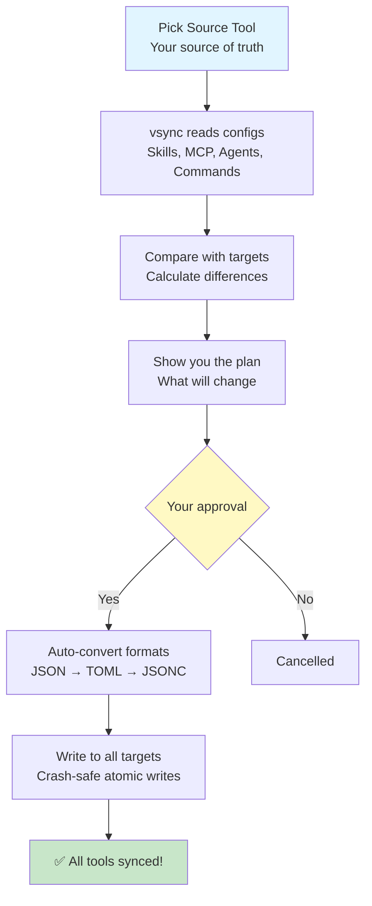

# Core Concepts

Learn the fundamental concepts that power vsync.

## How vsync Works

vsync follows a simple but powerful workflow:



### The Process

1. **Read Source**: vsync reads configuration from your chosen source tool
2. **Normalize**: Converts tool-specific formats to a unified data model
3. **Calculate Diff**: Compares source with targets using 3-way diff (source, target, manifest)
4. **Generate Plan**: Creates a detailed sync plan showing all operations
5. **User Approval**: Shows the plan and asks for confirmation
6. **Transform**: Converts unified model to each target tool's format
7. **Atomic Write**: Safely writes changes with crash protection
8. **Update Manifest**: Tracks sync state for future operations

## Source of Truth Concept

vsync uses a **unidirectional sync model**:

- **Source Tool**: Your reference standard—where you edit configurations
- **Target Tools**: They sync FROM the source—changes here will be overwritten

```
Claude Code (Source)  →  Cursor (Target)
                      →  OpenCode (Target)
                      →  Codex (Target)
```

### Important Rules

1. **Edit in Source Only**: Always make changes in your source tool
2. **Targets Get Overwritten**: Manual changes in targets are lost on next sync
3. **Switch Source Anytime**: Re-run `init` to choose a different source

## Configuration Layers

vsync supports two configuration layers:

### Project Layer (Default)

Located at: `<project>/.vsync.json`

**Use for**:
- Team-shared configurations
- Project-specific skills and MCP servers
- Checked into version control

```bash
vsync init       # Create project config
vsync sync       # Sync project configs
```

### User Layer (Global)

Located at: `~/.vsync.json`

**Use for**:
- Personal global configurations
- User-specific skills and preferences
- Not shared with team

```bash
vsync init --user    # Create user config
vsync sync --user    # Sync user configs
```

## Sync Modes

vsync offers two sync modes to handle different scenarios:

### Safe Mode (Default)

**What it does**:
- ✅ Creates new items
- ✅ Updates existing items
- ❌ **Never deletes**

**When to use**: Daily syncing, team environments, when you want conservative behavior

```bash
vsync sync
```

**Example**:
```
Source: skill-a, skill-b, skill-c
Target: skill-a, skill-b, skill-old

Result: skill-a, skill-b, skill-c, skill-old (old one kept)
```

### Prune Mode

**What it does**:
- ✅ Creates new items
- ✅ Updates existing items
- ⚠️ **Deletes items not in source**

**When to use**: Cleaning up old configs, strict mirroring, when you want exact replicas

```bash
vsync sync --prune
```

**Example**:
```
Source: skill-a, skill-b, skill-c
Target: skill-a, skill-b, skill-old

Result: skill-a, skill-b, skill-c (old one removed)
```

## The Manifest System

vsync uses a manifest file (`.vsync-cache/manifest.json`) to track sync state.

### What the Manifest Does

1. **Change Detection**: Uses SHA256 hashes to detect modifications
2. **Skip Unchanged**: Avoids re-syncing identical configs
3. **Track History**: Records when each item was last synced
4. **Target State**: Tracks what was written to each target tool

### Manifest Structure

```json
{
  "version": "1.0.0",
  "last_sync": "2026-01-25T10:30:00Z",
  "items": {
    "skill/git-release": {
      "type": "skill",
      "hash": "abc123...",
      "last_synced": "2026-01-25T10:30:00Z",
      "targets": {
        "cursor": "abc123...",
        "opencode": "abc123..."
      }
    }
  }
}
```

### Why Hash-Based Tracking?

- **Fast**: No need to read file contents to check for changes
- **Accurate**: Even tiny changes are detected
- **Cross-Tool**: Works regardless of format differences

## Atomic Operations

All file writes use atomic operations to prevent corruption:

1. **Write to Temp**: Content written to `.tmp` file
2. **fsync**: Force data to disk
3. **Atomic Rename**: Replace original file
4. **Rollback on Error**: Restore backups if anything fails

This ensures your configs are never left in a corrupted state, even if the process crashes.

## Environment Variable Preservation

vsync **never expands** environment variables—it preserves the syntax:

```json
// Source (Claude Code)
{
  "env": {
    "TOKEN": "${GITHUB_TOKEN}"
  }
}

// Target (Cursor) - syntax converted, but NOT expanded
{
  "env": {
    "TOKEN": "${env:GITHUB_TOKEN}"
  }
}
```

### Why This Matters

- **Security**: Secrets stay as references, not hardcoded values
- **Portability**: Configs work across different environments
- **Safety**: No accidental secret exposure in files

## Supported Configuration Types

### Skills

Reusable agent instruction templates following the Agent Skills standard.

**Structure**: `<skill-name>/SKILL.md`

**Supported by**: All tools (Claude Code, Cursor, OpenCode, Codex)

### MCP Servers

Model Context Protocol server configurations for external integrations.

**Structure**: Tool-specific config files (JSON/TOML)

**Supported by**: All tools with different formats

### Agents (v1.1+)

Custom AI agent definitions.

**Structure**: `<agent-name>.md`

**Supported by**: Claude Code, OpenCode

### Commands (v1.1+)

Quick command shortcuts.

**Structure**: `<command-name>.md`

**Supported by**: Claude Code, Cursor, OpenCode

## Next Steps

Now that you understand the core concepts:

- Learn about [Configuration](/en/docs/configuration) file structure
- Explore [CLI Commands](/en/docs/cli-commands) in detail
- Discover [Advanced Features](/en/docs/advanced-features) like symlinks
