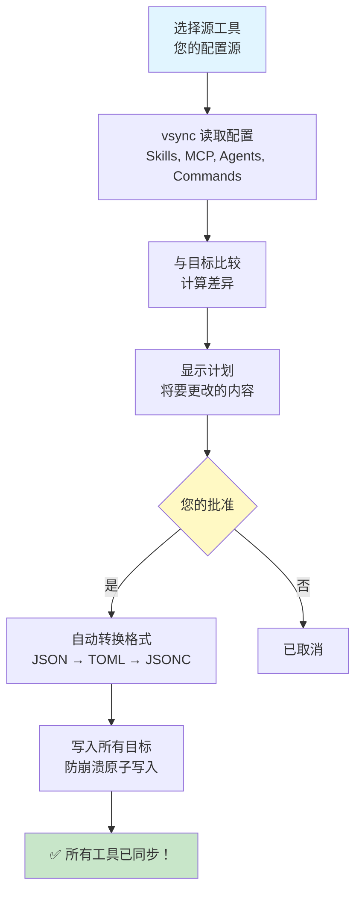

# 核心概念

了解驱动 vsync 的基本概念。

## vsync 如何工作

vsync 遵循简单但强大的工作流程：



### 工作流程

1. **读取源**：vsync 从您选择的源工具读取配置
2. **标准化**：将工具特定格式转换为统一数据模型
3. **计算差异**：使用 3-way diff（源、目标、manifest）比较源和目标
4. **生成计划**：创建详细的同步计划，显示所有操作
5. **用户批准**：显示计划并请求确认
6. **转换**：将统一模型转换为每个目标工具的格式
7. **原子写入**：安全地写入更改，具有崩溃保护
8. **更新 Manifest**：为未来操作跟踪同步状态

## Source of Truth 概念

vsync 使用**单向同步模型**：

- **Source Tool（源工具）**：您的参考标准——您编辑配置的地方
- **Target Tools（目标工具）**：它们从源同步——这里的更改将被覆盖

```
Claude Code (Source)  →  Cursor (Target)
                      →  OpenCode (Target)
                      →  Codex (Target)
```

### 重要规则

1. **仅在源中编辑**：始终在源工具中进行更改
2. **目标会被覆盖**：目标工具中的手动更改在下次同步时会丢失
3. **随时切换源**：重新运行 `init` 以选择不同的源

## 配置层级

vsync 支持两个配置层级：

### Project 层（默认）

位置：`<project>/.vsync.json`

**用于**：
- 团队共享配置
- 项目特定的 Skills 和 MCP 服务器
- 提交到版本控制

```bash
vsync init       # 创建项目配置
vsync sync       # 同步项目配置
```

### User 层（全局）

位置：`~/.vsync.json`

**用于**：
- 个人全局配置
- 用户特定的 Skills 和偏好
- 不与团队共享

```bash
vsync init --user    # 创建用户配置
vsync sync --user    # 同步用户配置
```

## 同步模式

vsync 提供两种同步模式来处理不同场景：

### Safe 模式（默认）

**功能**：
- ✅ 创建新项
- ✅ 更新现有项
- ❌ **从不删除**

**何时使用**：日常同步、团队环境、希望保守行为时

```bash
vsync sync
```

**示例**：
```
源: skill-a, skill-b, skill-c
目标: skill-a, skill-b, skill-old

结果: skill-a, skill-b, skill-c, skill-old (保留旧项)
```

### Prune 模式

**功能**：
- ✅ 创建新项
- ✅ 更新现有项
- ⚠️ **删除源中不存在的项**

**何时使用**：清理旧配置、严格镜像、希望精确复制时

```bash
vsync sync --prune
```

**示例**：
```
源: skill-a, skill-b, skill-c
目标: skill-a, skill-b, skill-old

结果: skill-a, skill-b, skill-c (删除旧项)
```

## Manifest 系统

vsync 使用 manifest 文件（`.vsync-cache/manifest.json`）来跟踪同步状态。

### Manifest 的作用

1. **变更检测**：使用 SHA256 哈希值检测修改
2. **跳过未更改**：避免重新同步相同配置
3. **跟踪历史**：记录每个项的最后同步时间
4. **目标状态**：跟踪写入每个目标工具的内容

### Manifest 结构

```json
{
  "version": "1.0.0",
  "last_sync": "2026-01-25T10:30:00Z",
  "items": {
    "skill/git-release": {
      "type": "skill",
      "hash": "abc123...",
      "last_synced": "2026-01-25T10:30:00Z",
      "targets": {
        "cursor": "abc123...",
        "opencode": "abc123..."
      }
    }
  }
}
```

### 为什么使用基于哈希的跟踪？

- **快速**：无需读取文件内容即可检查更改
- **准确**：即使是微小的更改也能被检测到
- **跨工具**：无论格式差异如何都能工作

## 原子操作

所有文件写入都使用原子操作来防止损坏：

1. **写入临时文件**：内容写入 `.tmp` 文件
2. **fsync**：强制数据写入磁盘
3. **原子重命名**：替换原始文件
4. **错误回滚**：如果出现任何问题，恢复备份

这确保您的配置永远不会处于损坏状态，即使进程崩溃也是如此。

## 环境变量保留

vsync **从不展开**环境变量——它保留语法：

```json
// 源（Claude Code）
{
  "env": {
    "TOKEN": "${GITHUB_TOKEN}"
  }
}

// 目标（Cursor）- 语法已转换，但未展开
{
  "env": {
    "TOKEN": "${env:GITHUB_TOKEN}"
  }
}
```

### 为什么这很重要

- **安全性**：密钥保持为引用，而不是硬编码值
- **可移植性**：配置可在不同环境中工作
- **安全性**：不会在文件中意外暴露密钥

## 支持的配置类型

### Skills

遵循 Agent Skills 标准的可复用 Agent 指令模板。

**结构**：`<skill-name>/SKILL.md`

**支持工具**：所有工具（Claude Code、Cursor、OpenCode、Codex）

### MCP Servers

用于外部集成的 Model Context Protocol 服务器配置。

**结构**：工具特定的配置文件（JSON/TOML）

**支持工具**：所有工具，但格式不同

### Agents (v1.1+)

自定义 AI 代理定义。

**结构**：`<agent-name>.md`

**支持工具**：Claude Code、OpenCode

### Commands (v1.1+)

快捷命令。

**结构**：`<command-name>.md`

**支持工具**：Claude Code、Cursor、OpenCode

## 下一步

现在您理解了核心概念：

- 了解[配置](../configuration)文件结构
- 详细探索 [CLI 命令](../cli-commands)
- 发现[高级功能](../advanced-features)，如 symlinks
